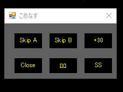

# こめなすプレーヤー について
  
＊画像は「PC TV Plus」と「commenomi」を組み合わせて再生させたイメージです  

## 概要
komenasneと連携して、PC TV Plusとcommenomiを制御するツールです。
※基本的に中でどう動いているのか何をやっているのかを理解をしていないと使うのは難しいです。
Waitの調整なども各々のPCによってソースコードを調整変更しないといけないかもしれません。

## 設定
以下の2ファイルをkomenasne.exeが入ったフォルダに入れてください。
komenasplayer.bat
komenasplayer.ps1

komenasplayer.batのショートカットをデスクトップ等、使いやすいところに配置してください。

# 使い方
komenasplayer.batを実行すると起動します。
トルネ風の画面配置が必要です。[komenasneでトルネっぽく実況コメント付きでnasneの動画を再生させる](https://note.com/kamm/n/n8a519502718c)を参考にしてください。

  
「Skip A」次のチャプターとAのコメントまで移動します
「Skkp B」次のチャプターとBのコメントまで移動します
「Open」動画を再生したあとにクリックするとkomenasneと連携してcommenomiが開き、PC TV Plusを倍速再生に変更します。
「Close」Openを押すとCloseに変わります。commenomiを閉じて、動画の再生を終了します。
「ﾛﾛ」動画とコメントの再生を一時停止します
「SS」スクリーンショットを保存します