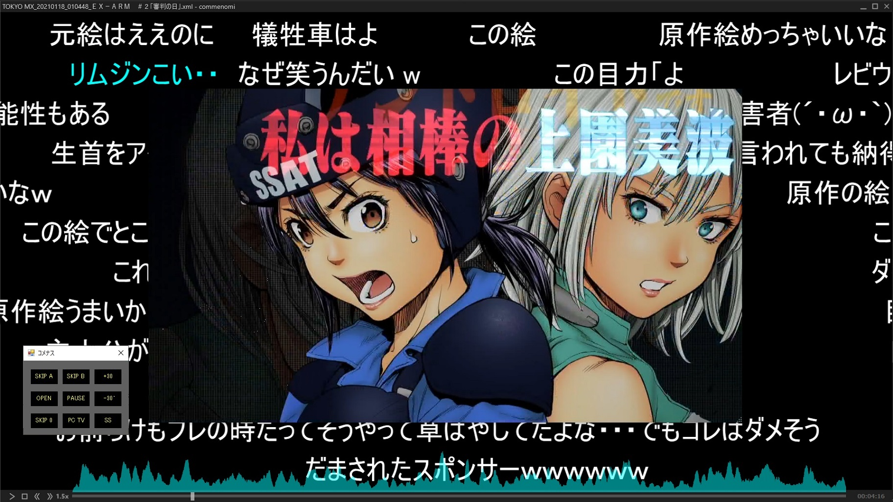
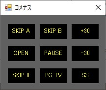
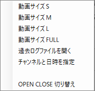
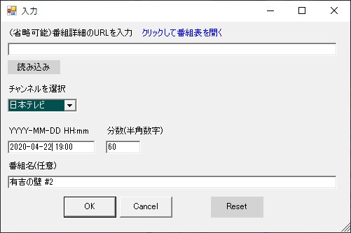

# コメナスPlayer について
  
＊画像は「PC TV Plus」と「commenomi」を組み合わせて再生させたイメージです  

### [ダウンロードはこちら](https://github.com/nyumen/komenasplayer/releases)
  
## 概要
komenasneと連携して、PC TV Plus（有料）とcommenomiを制御するツールです。両方のアプリが必要です。  
マウスやキーボードの動きを自動化しているのですがかなり無理矢理に動作させているため、たまに動かないときは手動で補助する必要があります。

## komenasplayerの設定
以下のフォルダ配置を前提にしています。  
異なる環境にしたい場合はkomenasplayer_config.ps1をテキストエディタで開いて修正してください。

    ├─commenomi  
    │  └─commenomi.exe  
    ├─komenasne  
    │  ├─komenasne.exe  
    │  ├─komenasne.ini  
    │  └─kakolog  
    └─komenasplayer  
        ├─komenasplayer.bat  
        ├─komenasplayer.ps1  
        ├─komenasplayer_config.ps1  
        └─screenshot  
  
komenasplayer.batのショートカットをデスクトップ等、使いやすいところに配置してください。  
  
## PC TV Plusの設定
「アプリの設定」→「画面表示と操作性」を選んで以下のように修正してください。  
- 常に最前面で表示する（ウィンドウモード）にチェックされていた場合、チェックを外す  
- 常に最前面で表示する（全画面モード）にチェックされていた場合、チェックを外す  
  
「アプリの設定」→「番組の再生」を選んで以下のように修正してください。  
- 早見再生の速度を1.5倍に設定  
- フラッシュ (+) を30秒に設定  
- フラッシュ (-) を15秒に設定  
  
## commenomiの設定
■共通設定  
- 再生速度を1.5倍に設定（倍速再生しない場合は不要）  
- 「操作パネルを常に表示する」に設定  
  
■torneと似たモードで再生する場合  
- 「このウィンドウを常に最前面に」のチェックを*外す*  
- 「透過方式」を「透過しない」に設定  
  
■ニコニコ動画と似たモードで再生する場合  
  
- 「このウィンドウを常に最前面に」のチェックを*付ける*  
- 「透過方式」を「Windows Aero(推奨)」に設定  
*【重要】このモードで再生する場合commenomiがコメナスPlayerより上に表示されるため、commenomiをダブルクリックして一時的に表示を小さくしてください。*
  
# 使い方
komenasplayer.batを実行すると起動します。  
PC TV Plusで動画を再生したあとに、気持ちゆっくりめでコメナスPlayerの「OPEN」をクリックしてください。  
動画の再生が終わったら、先程のOPENがCLOSEに変化しているので「CLOSE」をクリックしてください。  

  
※重要な仕様
「OPEN」を押したあと、もしくはボタンの外のグレーの部分をクリックすると小さくなって半透明になります。  
半透明のところにマウスカーソルを乗せると、もとの大きさに戻りますので、見失わないでください。  

- 「SKIP A」次のチャプターとAのコメントまでスキップします（アニメ作品限定）  
- 「SKIP B」次のチャプターとBのコメントまでスキップします（アニメ作品限定）  
- 「+30」30秒早送りします  
- 「-30」30秒巻き戻しします  
- 「PAUSE」動画とコメントの再生を一時停止します  
- 「OPEN」動画を再生したあとにクリックするとkomenasneと連携してcommenomiが開き、PC TV Plusを倍速再生に変更します  
- 「CLOSE」Openを押すとCloseに変わります。commenomiを閉じて、動画の再生を終了します  
- 「SKIP 0」再生位置をはじめに戻します  
- 「PC TV」PC TV Plusを起動します。すでに起動済みの場合は再起動します  
- 「SS」スクリーンショットを取得します。画像はscreenshotフォルダに保存されます。  
  
「右クリック」以下のメニューが表示されます。  
  
- 「動画サイズ S」
- 「動画サイズ M」
- 「動画サイズ L」
- 「動画サイズ FULL」（commenomiのコメント表示を半透明にして、最前列で再生にチェックをしてください）  
- 「過去ログファイルを開く」kakologフォルダに保存された、すでに取得済みの過去ログファイルを開きます。  
- 「チャンネルと日時を指定」nasneを参照せず、チャンネルと日時を指定して実況コメントを取得します。ネット配信の番組などの視聴時に便利です。  
  
- 「OPEN CLOSE 切り替え」コメナスPlayerを終了してしまった場合などに、OPENをCLOSEに戻すときなどに使用します。  
